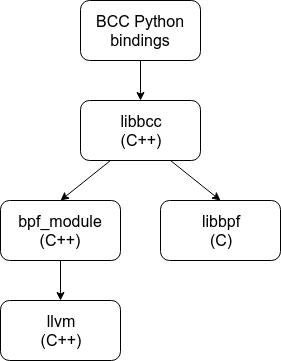

# How I ended up writing opensnoop in pure C using eBPF

**Michael Bolin, September 2017**

Recently, I was trying to debug a performance issue in [Eden](https://github.com/facebookexperimental/) with a coworker. He started spitting out things to try: “run vmstat 1,” “check iostat,” “ok, now mpstat,” etc. If you know what all of those are and how to interpret their output, then you are way ahead of me. At the time, I unquestioningly typed in the commands and stared blankly at the output, quietly nodding, waiting for my coworker to interpret the numbers and tell me what to run next.

Shortly thereafter, I asked myself: “Was I out playing Frisbee in the quad the day they went over Linux performance tools in school? How am I supposed to learn this stuff? Is there one book I can read to learn what I need to know? Why are there so many commands I need to learn?” I asked around and a friend told me to look at http://brendangregg.com/ to learn about performance engineering.

When you first visit Brendan's site, it's pretty overwhelming. With his long list of articles, talks, books, and of course, software, it's clear that Brendan is incredibly prolific and conscientious about sharing what he knows with everyone. When it comes to learning about computing performance, I haven't found anything that is a close second to Brendan or his web site.

So where to begin? On his [Linux Performance](http://brendangregg.com/linuxperf.html) page, the section on talks is organized “[i]n rough order of recommended viewing or difficulty, intro to more advanced,” so I figured I would start at the top and work my way down, as appropriate.

## Part 1: Learning Begins

Explain what opensnoop is in here: http://www.brendangregg.com/blog/2014-07-25/opensnoop-for-linux.html

* USE method: http://brendangregg.com/usemethod.html
* Performance checklists: http://www.brendangregg.com/blog/2016-05-04/srecon2016-perf-checklists-for-sres.html
* eBPF
* Flame graphs: http://brendangregg.com/flamegraphs.html

## Part 2: Initial foray into eBPF

After spending a bit of time with Brendan and Julia's material, what seemed like an obvious question to me was: “Why not build a version of strace in Rust that uses eBPF?” From what I had read, it sounded like eBPF could help with the performance issues of strace (which uses `ptrace(2)` under the hood) while also satisfying my personal (yet admittedly misguided) desire to replace C code with Rust whenever I encounter it. My gut feeling was that it should be possible to precompute the eBPF bytecode such that this new tracer written in pure Rust could start up very fast. This seemed like a worthwhile project that would give me an excuse to get my hands dirty with eBPF. I could call it **rstrace**!

Because I suspected this would not be an original idea, instead of just trying to *do* it, I decided to see if someone else had already done it. I found a handful of projects/articles that were related:

* [“PoC: compiling to eBPF from Rust”](http://unhandledexpression.com/general/rust/2018/02/02/poc-compiling-to-ebpf-from-rust.html) is a blog post by Geoffroy Couprie that shows how to use the LLVM toolchain to compile a Rust program into eBPF bytecode. Admittedly one of the shortcomings of the example is that it requires a separate binary written in Go to load/run the eBPF program.
* [vltrace](https://github.com/pmem/vltrace) is an open source project to build an strace that uses eBPF. It is written in C (bleh) and it [compiles all of the eBPF bytecode on the fly from generated C source every time it is run](https://github.com/pmem/vltrace/blob/512496d7e9f0688d4dad1931a0a212ae4c8f51ad/src/vltrace.c#L376-L403) (double bleh).
* The Rust [bcc-sys crate](https://crates.io/crates/bcc-sys) provides Rust bindings for [BCC](https://github.com/iovisor/bcc) while the [bcc crate](https://crates.io/crates/bcc) (initially created by Julia Evans) tries to provide a cleaner API on top of `bcc-sys`. Like vltrace, [this also compiles the eBPF bytecode on the fly from C code](https://github.com/rust-bpf/rust-bcc/blob/60c5459cfd4baff40b001f2ffc974fddf8e02421/examples/opensnoop.rs#L35-L37).

I thought it was strange that both vltrace and the opensnoop example in the `bcc` crate chose to compile the eBPF bytecode on the fly. As a number of folks had noted in various articles I read, this required linking in a chunk of the LLVM toolchain and exercising it at runtime, which seemed inelegant if it could be avoided. For example, from Geoffroy's blog post:

“Unfortunately, those tools make a tradeoff that’s slightly annoying for me: they require installing BCC, which requires Python, LLVM and the complete Linux sources, on the target machines. It might be possible to precompile the programs though, but it does not look like it’s a common use case with BCC.”

I also thought it was strange that various attributes in Geoffroy's example were used to ensure code was written into specific sections of the ELF binary. My gut feeling was that this was *accidental* rather than *essential* complexity, but I wanted to be sure.

Because Geoffroy's article was inline with what I wanted to do and contained a lot of useful exposition, I decided to try to understand it in detail before I wrote any code of my own. Although his post contained a bunch of sample code [which initially turned out to contain numerous typos due to HTML escaping errors], it did not have an associated Git repo to clone to reproduce the results. I decided that my first order of business would be to reproduce the results of the blog post locally. (Ultimately, I would make my code available at https://github.com/bolinfest/rust-ebpf-demo/, then I [notified Geoffroy](https://twitter.com/bolinfest/status/1039298420240863232) about my work and the typos, and [he fixed everything](https://twitter.com/gcouprie/status/1039424926615330817).)

I believe I used different versions of `rustc` and `clang` than the Geoffroy because (1) [I couldn't compile his Rust code](https://twitter.com/bolinfest/status/1039550675850416128), and (2) my version of the eBPF program was only 14 instructions whereas his was 36. I assumed that I was using a newer version of the LLVM toolchain with improved optimizations for eBPF codegen, but I wanted to be sure they were functionally equivalent. To that end, I decided to go through the assembly line-by-line to ensure I understood everything.

I spent a lot of time reading the [“Unofficial eBPF spec”](https://github.com/iovisor/bpf-docs/blob/b5ac15bfefc25fb13b4178a3fed2932fc2a795f1/eBPF.md) on GitHub to learn about the different opcodes and their arguments. I [updated my README with a line-by-line annotation of the eBPF program](https://github.com/bolinfest/rust-ebpf-demo/#annotated-bytecode). As someone who has never bothered to learn x86[_64] assembly, this was quite tedious, but also enlightening. (This knowledge would also prove helpful down the road.) Ultimately, I discovered what the program is doing is pretty simple:

* First, it writes the C string `"hello from rust\n"` to the stack, which took two “wide” writes of 8 bytes each (for `"om rust\n"` and `"hello fr"`, respectively), plus a write of 1 byte for the trailing `\0` because it is a C string.
* The address of the C string is written to `r1` and its length (`17`, which includes the NUL byte) is written to `r2`.
* With the appropriate arguments for `bpf_trace_printk()` written to `r1` and `r2` ([as per the BPF calling convention](https://cilium.readthedocs.io/en/v1.2/bpf/#instruction-set)), the function (which corresponds to the number `6` because of [its position in the bpf_func_id enum](https://elixir.bootlin.com/linux/v4.7/source/include/uapi/linux/bpf.h#L153)) is called.
* Finally, the exit code (`0`) is written to `r0` and the program exits.

Reading through the bytecode from Geoffroy's blog post, it appears that it writes `"hello from rust\n\0"` to the stack one byte at a time, which explains why it takes so many more instructions.

Although I had now explained to myself how the eBPF program worked, understanding how to run it was another matter. Geoffroy's blog post mentioned [a blog post on gobpf](https://kinvolk.io/blog/2017/09/an-update-on-gobpf---elf-loading-uprobes-more-program-types/) that had code that could be used to run the `hello.o` ELF binary. Indeed, I found the code and [slightly modified it for myself](https://github.com/bolinfest/rust-ebpf-demo/blob/9ce6106649770ab7c5097513e744977715deaad6/go/main.go) to run `hello.o` successfully. I spent a bit of time looking at [elf.go from the gobpf project](https://github.com/iovisor/gobpf/blob/2e314be67b1854ad226f012f08a984e0e89b6da9/elf/elf.go) and figured out how it loaded data based on ELF section names to make calls into functions like `bpf_prog_load()`, but I still wasn't convinced that packaging an eBPF program this way was strictly *necessary*. I would try to write my own standalone eBPF program to find out for sure.

## Part 3: Standalone eBPF program without libbpf

My first thought was to write a standalone C program that would load and run the `bpf_trace_printk()` eBPF program from Geoffroy's blog post. I figured this would help me answer the question of whether I needed the labeled ELF sections mentioned in the blog post and whether I would have to port a bunch of the Go code in https://github.com/iovisor/gobpf/tree/master/elf to Rust to build rstrace.

After reading `bpf(2)`, I thought this program was going to be simple to implement. I assumed all I would have to do is:

* Define the eBPF program as an array of BPF bytecodes.
* Call `bpf()` with `cmd=BPF_PROG_LOAD` and `attr.type=BPF_PROG_TYPE_KPROBE` to load the eBPF program and attach it as a kprobe.

These assumptions were not quite correct.

### Loading the Program

My first surprise was that despite doing `#include <linux/bpf.h>`, there was no `bpf()` function for me to call. Instead, I had to use `syscall(2)` to call `bpf(2)` even though I expected there to be a `bpf()` function available since everything else I ever looked up in [section 2](https://en.wikipedia.org/wiki/Man_page#Manual_sections) had a function of same name:

```
syscall(__NR_bpf, BPF_PROG_LOAD, &attr, sizeof(attr));
```

I had never used `syscall(2)` before, but I figured out it was what I needed by looking at the source for [libbpf.c](https://github.com/iovisor/bcc/blob/master/src/cc/libbpf.c). As I would discover, this would not be my only use of `syscall(2)` for this program. (My hypothesis is that there is no C wrapper function for `bpf()` because it came along later and could risk colliding with a user-defined function named `bpf()`.)

My next step was to generate the eBPF program. I didn't have to produce an array of binary bytecodes as I expected, but an array of `struct bpf_insn` objects. Honestly, this was easier than producing binary values because I didn't have to worry about the [endianness issues](https://cilium.readthedocs.io/en/v1.2/bpf/#llvm) I read about. Using BCC, [I wrote a Python program to dump the eBPF bytecode from the C version of my program](https://github.com/bolinfest/rust-ebpf-demo/commit/914b24a8c81189d8e278e2e1ce1df53c583f1a5d#diff-3552c49fbb4741b6095394bf1b4086a7) and print it out as an array of `struct bpf_insn` objects:

```py
import struct
from bcc import ArgString, BPF

# define BPF program
bpf_text = """
#include <uapi/linux/ptrace.h>
#include <uapi/linux/limits.h>
#include <linux/sched.h>

int trace_entry(struct pt_regs *ctx, int dfd, const char __user *filename)
{
    bpf_trace_printk("hello from rust\\n");
    return 0;
};
"""

def parse_instruction(instruction):
    # u8
    opcode = struct.unpack("B", instruction[0])[0]

    src_and_dst = struct.unpack("B", instruction[1])[0]
    # The low-order nibble is dst.
    dst_reg = src_and_dst & 0x0F
    # The high-order nibble is src.
    src_reg = (src_and_dst & 0xF0) >> 4

    # s16
    offset = struct.unpack("h", instruction[2:4])[0]
    # s32
    imm = struct.unpack("i", instruction[4:8])[0]
    return (opcode, dst_reg, src_reg, offset, imm)


bpf_insn_template = """\
  ((struct bpf_insn) {
      .code    = 0x%x,
      .dst_reg = BPF_REG_%d,
      .src_reg = BPF_REG_%d,
      .off     = %d,
      .imm     = %d,
  }),"""


def print_bpf_insn_struct(bytecode):
    """Prints the eBPF bytecode as the equivalent bpf_insn[] in C."""
    print("struct bpf_insn prog[] = {")
    for b_offset in xrange(0, len(bytecode), 8):
        instruction = bytecode[b_offset : b_offset + 8]
        opcode, dst_reg, src_reg, offset, imm = parse_instruction(instruction)
        print(bpf_insn_template % (opcode, dst_reg, src_reg, offset, imm))
    print("};")


bpf = BPF(text=bpf_text)
bytecode = bpf.dump_func("trace_entry")
print_bpf_insn_struct(bytecode)
```

Because this was a one-time conversion, I copied the generated C code into my program.

Incidentally, `bpf_insn` is the first struct I had ever seen that declared fields as nibbles. (For the uninitiated, “nibble” is a real term that is means “4 bits,” so named because it is “half a byte,” get it?) Here is the declaration of the struct:

```c
struct bpf_insn {
  __u8 code;       // opcode
  __u8 dst_reg:4;  // dest register
  __u8 src_reg:4;  // source register
  __s16 off;       // signed offset
  __s32 imm;       // signed immediate constant
};
```

Note how there is a `:4` after the second two fields, indicating that each field contributes 4 bits. Because the maximum value of 4 (unsigned) bits is 1111 in binary (15 in decimal), then the compiler will complain if you try to assign a value greater than 15 to either `dst_reg` or `src_reg`. To verify the bit representation of the struct, I wrote a small program:

```c
#include <linux/bpf.h>
#include <stdio.h>

int main(int argc, char **argv) {
  struct bpf_insn instruction = (struct bpf_insn){
      .code = 0x18,
      .dst_reg = 0x0e,
      .src_reg = 0x07,
      .off = 0xcafe,
      .imm = 0x72206d6f,
  };
  fwrite(&instruction, sizeof(instruction), 1, stdout);
}
```

When I compile and run the program on my system, piping the output to `xxd`, I get:

```
00000000: 187e feca 6f6d 2072                      ....om r
```

As you can see, the struct is written as little-endian based on the way the `imm` field is serialized. What is perhaps less obvious is that `dst_reg` is the low-order nibble and `src_reg` is the high-order nibble in the second byte written to the output.

Incidentally, you are not limited to nibble boundaries when declaring structs (or even requiring all sub-byte fields to be the same type or signed-ness) as I discovered I could also do:

```c
struct example {
  char f1 : 3;
  char f2 : 3;
  __u8 f3 : 2;
};
struct example ex = (struct example){
    .f1 = -1,
    .f2 = 2,
    .f3 = 3,
};
fwrite(&ex, sizeof(ex), 1, stdout);
```

Anyway, back to the problem at hand...

Things got interesting/frustrating here because my call to `bpf(2)` was failing with `EINVAL`. I wasn't sure what I could be doing wrong as the only relevant mention of `EINVAL` in the man page was: “For `BPF_PROG_LOAD`, indicates an attempt to load an invalid program. eBPF programs can be deemed invalid due to unrecognized instructions, the use of reserved fields, jumps out of range, infinite loops or calls of unknown functions.”

I tried running my program under `gdb` to make sure all of the values I was passing to `bpf(2)` were what I expected. I discovered that the way I calculated the instruction count was incorrect, so I fixed that. Again, I looked at `libbpf.c` to see how they implemented `bpf_prog_load()` and I noticed that they [zeroed the bpf_attr before writing to it](https://github.com/iovisor/bcc/blob/89aefcc9a89216da3558b891e0d6cb235b0e07a0/src/cc/libbpf.c), so I added code to do that. These were issues that had to be fixed, but I was still getting `EINVAL`.

I tried looking in various places for a more detailed error message. I ran `dmesg -T | tail`, but there was nothing there. Looking at the `libbpf.c` further, [I discovered I should also check the log_buf I passed into bpf_prog_load()](https://github.com/iovisor/bcc/blob/89aefcc9a89216da3558b891e0d6cb235b0e07a0/src/cc/libbpf.c#L599-L608), as an error message could be printed there, but that also came up empty.

I was pretty frustrated at this point because my implementation of `bpf_prog_load()` was basically [taken straight from the man page](https://github.com/mkerrisk/man-pages/blob/man-pages-4.15/man2/bpf.2#L724-L742):

```c
char bpf_log_buf[LOG_BUF_SIZE];

int bpf_prog_load(enum bpf_prog_type type,
                  const struct bpf_insn *insns, int insn_cnt,
                  const char *license)
{
  union bpf_attr attr = {
    .prog_type = type,
    .insns     = ptr_to_u64(insns),
    .insn_cnt  = insn_cnt,
    .license   = ptr_to_u64(license),
    .log_buf   = ptr_to_u64(bpf_log_buf),
    .log_size  = LOG_BUF_SIZE,
    .log_level = 1,
  };

  return bpf(BPF_PROG_LOAD, &attr, sizeof(attr));
}
```

Even though I was using gdb, [I couldn't step into a system call](https://stackoverflow.com/questions/5999205/cannot-step-into-system-call-source-code), so I had only one other option to find the source of the `EINVAL`: **to read the Linux source code**.

For whatever reason, I have never looked at the Linux source code before (mostly GPL paranoia, if I'm honest about it). However, [my answer was right there in the code](https://github.com/torvalds/linux/blob/v4.15/kernel/bpf/syscall.c#L1140-L1142), plain as day:

```c
    if (type == BPF_PROG_TYPE_KPROBE &&
        attr->kern_version != LINUX_VERSION_CODE)
        return -EINVAL;
```

As you can see, the sample implementation of `bpf_prog_load()` from the man page makes no mention of `kern_version`, though clearly the Linux kernel will reject your eBPF program with `EINVAL` if `prog_type=BPF_PROG_TYPE_KPROBE` if `kern_version != LINUX_VERSION_CODE`. I then searched the man page for `kern_version`, and there is indeed a note:

```c
union bpf_attr {
  struct {    /* Used by BPF_MAP_CREATE */
    __u32   map_type;
    __u32   key_size;    /* size of key in bytes */
    __u32   value_size;  /* size of value in bytes */
    __u32   max_entries; /* maximum number of entries
                            in a map */
  };

  struct {    /* Used by BPF_MAP_*_ELEM and BPF_MAP_GET_NEXT_KEY
                 commands */
    __u32   map_fd;
    __aligned_u64 key;
    union {
      __aligned_u64 value;
      __aligned_u64 next_key;
    };
    __u64   flags;
  };

  struct {    /* Used by BPF_PROG_LOAD */
    __u32   prog_type;
    __u32   insn_cnt;
    __aligned_u64 insns;      /* 'const struct bpf_insn *' */
    __aligned_u64 license;    /* 'const char *' */
    __u32   log_level;        /* verbosity level of verifier */
    __u32   log_size;         /* size of user buffer */
    __aligned_u64 log_buf;    /* user supplied 'char *' buffer */
    __u32   kern_version;
                        /* checked when prog_type=kprobe
                           (since Linux 4.1) */
  };
} __attribute__((aligned(8)));
```

I added `#include <linux/version.h>` to the top of my file and set `kern_version` on my `bpf_attr` and now my `bpf_prog_load()` function succeeded!

That said, I had misgivings about hardcoding `LINUX_VERSION_CODE` in my source because that meant I could not give the binary version of my program to someone on a slightly different version of the kernel because the version number from my machine would be hardcoded into the binary, causing the version check in a machine with a different kernel to fail. I thought it would be better to calculate the version number dynamically using `uname(2)`; however, I tried running the following on my machine:

```c
#include <linux/version.h>
#include <stdio.h>
#include <stdlib.h>
#include <string.h>
#include <sys/utsname.h>

int main(int argc, char **argv) {
  struct utsname buf;
  if (uname(&buf) < 0) {
    perror("Error calling uname()");
    return 1;
  }

  printf("utsname.release: %s\n", buf.release);

  int version = atoi(buf.release);
  char* firstDot = strstr(buf.release, ".");
  int patchlevel = atoi(firstDot + 1);
  char* secondDot = strstr(firstDot + 1, ".");
  int sublevel = atoi(secondDot + 1);

  printf("LINUX_VERSION_CODE: %d\n", LINUX_VERSION_CODE);
  printf("KERNEL_VERSION(%d, %d, %d): %d\n", version, patchlevel, sublevel,
         KERNEL_VERSION(version, patchlevel, sublevel));

  return 0;
}
```

When I ran it on my machine (which reports `4.15.0-33-generic` when I run `uname -r`), I got:

```
utsname.release: 4.15.0-33-generic
LINUX_VERSION_CODE: 266002
KERNEL_VERSION(4, 15, 0): 265984
```

In other words, calculating the Linux version based on `uname(2)` yields a number that does not match `LINUX_VERSION_CODE`! It seemed I would have to hardcode it. (Incidentally, BCC appears to support a [BCC_LINUX_VERSION_CODE environment variable](https://github.com/iovisor/bcc/blob/3d2211632247ad0d1ee9d1ecc1162764322eb974/docs/reference_guide.md#2-kernel-version-overriding) to help with this, but I don't believe it would help with the `uname`/`LINUX_VERSION_CODE` mismatch that I was seeing.)

### Attaching the Kprobe

Unfortunately, my program did not actually do anything because I needed to attach a kprobe. Again, I took a look at [the implementation of bpf_attach_kprobe() in libbpf.c](https://github.com/iovisor/bcc/blob/3d2211632247ad0d1ee9d1ecc1162764322eb974/src/cc/libbpf.c#L820-L872) to see what was going on: it was not a simple call to `bpf(2)` as I thought. Because I wanted to avoid linking in libbpf because I (erroneously! see next section) thought it would pull in LLVM, [I decided to copy the minimal subset of libbpf.c that I needed directly into my program](https://github.com/bolinfest/rust-ebpf-demo/commit/55e880d04329c25d1271a44e9c9d147c1c04ba2d#diff-3552c49fbb4741b6095394bf1b4086a7). (I also had to lift some code from [the attach_kprobe() function in the Python wrapper](https://github.com/iovisor/bcc/blob/27e7aeab5d7b9f0f4259fb0f996274af0521243f/src/python/bcc/__init__.py#L575-L598) to figure out what arguments to pass to `bpf_attach_kprobe()` in C.)

I made a few typos in the process, so I finally had the bright idea to modify the Python program I used to generate the eBPF bytecode to attach the kprobe:

```py
# bytecode = bpf.dump_func("trace_entry")
# print_bpf_insn_struct(bytecode)
bpf.attach_kprobe(event="do_sys_open", fn_name="trace_entry")
```

and then run it under `strace -s 256`. Most of the output was BCC doing its thing, but once I found my `bpf(2)` call, I could attribute everything thereafter to the `bpf.attach_kprobe()` call in the Python code:

```
bpf(BPF_PROG_LOAD, {prog_type=BPF_PROG_TYPE_KPROBE, insn_cnt=14, insns=0x7f4d928737d0, license="GPL", log_level=0, log_size=0, log_buf=0, kern_version=266002, prog_flags=0, ...}, 72) = 3
openat(AT_FDCWD, "/sys/bus/event_source/devices/kprobe/type", O_RDONLY) = -1 ENOENT (No such file or directory)
openat(AT_FDCWD, "/sys/bus/event_source/devices/kprobe/format/retprobe", O_RDONLY) = -1 ENOENT (No such file or directory)
openat(AT_FDCWD, "/sys/kernel/debug/tracing/kprobe_events", O_WRONLY|O_APPEND) = 4
getpid()                                = 21014
write(4, "p:kprobes/p_do_sys_open_bcc_21014 do_sys_open", 45) = 45
close(4)                                = 0
openat(AT_FDCWD, "/sys/kernel/debug/tracing/events/kprobes/p_do_sys_open_bcc_21014/id", O_RDONLY) = 4
read(4, "3987\n", 4096)                 = 5
close(4)                                = 0
perf_event_open({type=PERF_TYPE_TRACEPOINT, size=0 /* PERF_ATTR_SIZE_??? */, config=3987, ...}, -1, 0, -1, PERF_FLAG_FD_CLOEXEC) = 4
ioctl(4, PERF_EVENT_IOC_SET_BPF, 0x3)   = 0
ioctl(4, PERF_EVENT_IOC_ENABLE, 0)      = 0
ioctl(4, PERF_EVENT_IOC_DISABLE, 0)     = 0
close(4)                                = 0
openat(AT_FDCWD, "/sys/kernel/debug/tracing/kprobe_events", O_RDONLY) = 4
getpid()                                = 21014
fstat(4, {st_mode=S_IFREG|0644, st_size=0, ...}) = 0
read(4, "r:kprobes/r_do_sys_open_bcc_529 do_sys_open\nr:kprobes/r_do_sys_open_bcc_536 do_sys_open\nr:kprobes/r_do_sys_open_bcc_694 do_sys_open\nr:kprobes/r_do_sys_open_bcc_726 do_sys_open\nr:kprobes/r_do_sys_open_bcc_828 do_sys_open\nr:kprobes/r_do_sys_open_bcc_26648 do"..., 4096) = 4058
read(4, "p:kprobes/r_do_sys_open_bcc_14005 do_sys_open\np:kprobes/p_do_sys_open_bcc_14008 do_sys_open\np:kprobes/r_do_sys_open_bcc_14008 do_sys_open\np:kprobes/p_do_sys_open_bcc_14128 do_sys_open\np:kprobes/r_do_sys_open_bcc_14128 do_sys_open\np:kprobes/p_do_sys_open_bc"..., 4096) = 4086
read(4, "p:kprobes/p_do_sys_open_bcc_19790 do_sys_open\nr:kprobes/r_do_sys_open_bcc_19790 do_sys_open\np:kprobes/p_do_sys_open_bcc_20086 do_sys_open\nr:kprobes/r_do_sys_open_bcc_20086 do_sys_open\np:kprobes/p_do_sys_open_bcc_21443 do_sys_open\nr:kprobes/r_do_sys_open_bc"..., 4096) = 4092
read(4, "p:kprobes/p_do_sys_open_bcc_30643 do_sys_open\nr:kprobes/r_do_sys_open_bcc_30643 do_sys_open\np:kprobes/p_do_sys_open_bcc_30861 do_sys_open\nr:kprobes/r_do_sys_open_bcc_30861 do_sys_open\np:kprobes/p_do_sys_open_bcc_30866 do_sys_open\nr:kprobes/r_do_sys_open_bc"..., 4096) = 2840
close(4)                                = 0
openat(AT_FDCWD, "/sys/kernel/debug/tracing/kprobe_events", O_WRONLY|O_APPEND) = 4
getpid()                                = 21014
write(4, "-:kprobes/p_do_sys_open_bcc_21014", 33) = 33
close(4)                                = 0
```

(I felt a little sheepish that I didn't think of trying this earlier because if you scroll far to the right on the first line, you can see that `kern_version` is set on the `bpf_attr` passed to `bpf(2)`, which might have saved me a bunch of the time I spent debugging `bpf_prog_load()`.)

Once I could use strace to see what the Python+BCC version of my program was doing, it was easy to run the C version of my program under strace and verify that it was making the same syscalls. Moreover, one notable advantage of the pure C version of the program was that the strace output was 42 lines compared to the 10000+ lines from the Python+BCC version, making it much easier to read.

At long last, I had [a single C file](https://github.com/bolinfest/rust-ebpf-demo/blob/master/c/load-bpf.c) that ran the equivalent of Geoffroy's `trace_printk()` demo! Now it was time to try something more advanced.

## Part 4: Standalone opensnoop using eBPF in C

At this point, I believed rstrace was possible, but if I was going to be successful, I thought I still needed to learn a bit more about the code I would be trying to generate from Rust. To that end, I decided I to try to create something a little more complex than the `trace_printk()` example. In one of his talks, I believe Brendan mentioned that opensnoop is one of the first performance tools he writes for a new platform, so I thought I would try to do the same. Specifically, I would implement an `opensnoop.c` with the same design goals as my previous program: a standalone executable that loads and runs eBPF without using the BCC/LLVM toolchain at runtime. It would be functionally equivalent to [the version of opensnoop in the BCC repo that leveraged the Python bindings](https://github.com/iovisor/bcc/blob/f138fea5a9ab279b7347fa6acfd2f53777068b27/tools/opensnoop.py). (I would spend a lot of time with the original `opensnoop.py` in the course of this project.)

There were two new challenges in creating opensnoop that proved to be important opportunities for learning this time around:

* Parameterizing the eBPF program based on process id or thread id, as appropriate.
* Using BPF maps.

I also felt that copypasta'ing code from `libbpf.c` as I had done in my previous program was a bit gross and that I should `#include <bcc/libbpf.h>` instead. However, I wanted to be sure that I avoided pulling the LLVM toolchain into the final binary. It turned out that I had a number of incorrect assumptions on this point that are worth explaining.

### What is libbpf?

The main way I played with BCC/BPF was via the Python bindings. In particular, when reading [the main Python file](https://github.com/iovisor/bcc/blob/3d2211632247ad0d1ee9d1ecc1162764322eb974/src/python/bcc/__init__.py) (which I spent a lot of time with), I assumed that every call to a method in `lib` was a call to a method in libbpf. For example, because I saw a call to `lib.bpf_module_create_c_from_string()` [in the Python code](https://github.com/iovisor/bcc/blob/3d2211632247ad0d1ee9d1ecc1162764322eb974/src/python/bcc/__init__.py#L315) and [a method of same name in bpf_common.h](https://github.com/iovisor/bcc/blob/3d2211632247ad0d1ee9d1ecc1162764322eb974/src/cc/bpf_common.h#L29), I assumed that libbpf included all of `bpf_common.h`, which meant it depended on LLVM. Adding to my confusion was [another file in the BCC repo named bpf_common.h](https://github.com/iovisor/bcc/blob/3d2211632247ad0d1ee9d1ecc1162764322eb974/src/cc/compat/linux/bpf_common.h), but with a completely different API (the latter is a header-only file that defines a bunch of constants). I was very confused.

When I first started on opensnoop, instead of taking bits of `libbpf.c` piecemeal, I decided to take it in its entirety and copy over its transitive dependencies and see how big it was. I was surprised to discover that the list of files I ultimately needed to copy was quite small:

```
src/cc/compat/linux/bpf.h
src/cc/compat/linux/bpf_common.h
src/cc/libbpf.h
src/cc/libbpf.c
src/cc/perf_reader.h
src/cc/perf_reader.c
src/cc/setns.h
```

This seemed weird. The `src/cc` folder in the BCC repo was giant, but libbpf was only a tiny piece of it! I ran `nm -g /usr/lib/x86_64-linux-gnu/libbpf.so` to confirm that functions like `bpf_module_create_c_from_string()` were not part of libbpf.

After quite a bit of digging, I had a new mental model of how the code was organized:



This was an important breakthrough because it clarified the difference between libbcc (which is currently [src/cc/api/BPF.cc](https://github.com/iovisor/bcc/blob/3d2211632247ad0d1ee9d1ecc1162764322eb974/src/cc/api/BPF.cc) and [src/cc/api/BPFTable.cc](https://github.com/iovisor/bcc/blob/3d2211632247ad0d1ee9d1ecc1162764322eb974/src/cc/api/BPFTable.cc) and their transitive dependencies) and libbpf for me. (Personally, I would love to see the repo reorganized such that all of the code for libbpf is in its own directory.) In particular, I was now convinced that I could `#include <bcc/libbpf.h>` in my standalone opensnoop without pulling in LLVM.

### Generating the Bytecode

In one of Brendan's talks, he mentioned that one of the nice things the Python bindings for BCC allowed you to do was to dynamically populate a template of the C code for your BPF program at runtime. When I first watched the talk, I had no idea how important it was, but now that I was looking at his `opensnoop.py` code, I could see the appeal.

Specifically, opensnoop supports a `-p` option to filter events by process ID and a `-t` option to filter events by thread ID. Although this filtering could be done in user space, it is much more efficient to check it in kernel space (i.e., in the BPF program) to avoid writing unnecessary entries to a BPF map. Because the PID/TID filter values are not known to opensnoop until runtime, the BPF program cannot be precompiled. opensnoop works around this by dynamically generating the C code for BCC to compile in Python based on a template that is parameterized by `-p` and `-t`. At first glance, this seemed like it could potentially undermine everything I was trying to do: one of my prized design goals was to avoid using BCC at runtime.

My first potential workaround was to create a static BPF program that could read “parameters” at runtime via a BPF map. I [created a working prototype of this approach](https://github.com/bolinfest/bcc/commit/b60e496af5f76f3ea43a4dc2df4ed08d2b911285) and even [tweeted it to Brendan to get his thoughts](https://twitter.com/bolinfest/status/1039620317822345216). He main concern was the extra array lookup each time the kprobe was called. I also felt it was a bit inelegant, so I decided to try to do better.

My next idea was to try to create a version of the program without any filtering logic and store the array of instructions in my C program. If the user specified `-p` or `-t`, I could have some code that inserted extra bytecodes into the array to accommodate the specified filter. Although I think I could have made this work, I didn't think this was a good approach in the general case because inserting extra instructions at arbitrary positions could throw off existing jump instructions.

(I also noticed that `perf_event_open(2)` has a `pid_t pid` parameter. I thought I could use this to take care of filtering by PID, so I tried hardcoding the value to a specific process on my machine, but it did not have the intended effect. I noticed that `attach_kprobe()` in the BCC Python bindings hardcodes `pid=-1` when it calls into libbpf, whereas `attach_uprobe()` has a `pid` parameter that it passes through to libbpf, so perhaps it is ignored for kprobes.)

Because there were only three versions of the filter, I decided to use BCC to create three versions of the kprobe program: one with no filtering, one that included only events with PID=654321, and one that included only events with TID=123456. I chose canned filter values that were unlikely to appear as `imm` values in the generated bytecode.

Next I wrote some [Python code to post-process the bytecode](https://github.com/bolinfest/opensnoop-native/blob/5295cb008954bfeb7b169a3494d69e12d75b568c/debug.py#L202-L229), generating a C function that would write the appropriate array of `bpf_insn` values to the `struct bpf_insn[]` passed into the function. The key trick was that the Python code to generate the C code would take the original bytecode as well as a “placeholder” argument. For example, when generating the C function to filter by PID, [the “placeholder” argument to the Python function](https://github.com/bolinfest/opensnoop-native/blob/5295cb008954bfeb7b169a3494d69e12d75b568c/opensnoop.py#L94) is:

```py
{"param_type": "int", "param_name": "pid", "imm": 654321}
```

This means that when the Python code is iterating over the bytecode, if it finds an instruction with an `imm` equal to `654321`, instead of hardcoding the value `654321` for `imm` in the corresponding `struct bpf_insn`, it should specify it as the variable `pid` instead. Also, the function prototype for the generated C function should include `int pid` as a parameter.

The function prototypes for the C functions that generate the corresponding BPF programs are as follows (the `int fd3` param will be explained in the next section):

```c
void generate_trace_entry(struct bpf_insn instructions[], int fd3, int fd3);
void generate_trace_entry_tid(struct bpf_insn instructions[], int tid, int fd3);
void generate_trace_entry_pid(struct bpf_insn instructions[], int pid, int fd3);
```

The [Python code also inserts some constants into the generated C code](https://github.com/bolinfest/opensnoop-native/blob/5295cb008954bfeb7b169a3494d69e12d75b568c/opensnoop.py#L105-L118):

```c
#define MAX_NUM_TRACE_ENTRY_INSTRUCTIONS 35
#define NUM_TRACE_ENTRY_INSTRUCTIONS 28
#define NUM_TRACE_ENTRY_TID_INSTRUCTIONS 32
#define NUM_TRACE_ENTRY_PID_INSTRUCTIONS 35
#define NUM_TRACE_RETURN_INSTRUCTIONS 82
```

Each of the generated functions writes a BPF program into `instructions` ([the generated constants make it possible for the caller to create the instructions[] array with the appropriate size at compile time](https://github.com/bolinfest/opensnoop-native/blob/5295cb008954bfeb7b169a3494d69e12d75b568c/opensnoop.c#L333-L344)). The versions of the program that support filtering take `tid` and `pid` as parameters, as appropriate, and use them to set `imm` in the necessary place(s) in the generated BPF program. Although we are still generating the BPF program from a template dynamically at runtime, we are not using BCC at runtime, as it is only needed at build time when generating the C code.

One thing that I thought was interesting about compiling different versions of the program is that you get the “best” version in each scenario. That is, I was surprised to see the PID and TID versions of the program have different lengths:

* `generate_trace_entry()` generates a program with 28 instructions
* `generate_trace_entry_tid()` generates a program with 32 instructions
* `generate_trace_entry_pid()` generates a program with 35 instructions

It turns out that it is slightly more work to calculate the PID than the TID because calculating the PID requires a bit shift.

With the parameterization problem solved, I was ready to solve the mystery of how to wire up BPF maps!

### Working with BPF Maps

Perhaps my biggest challenge in this whole process was figuring out how BCC transformed logic in C code for BPF maps into eBPF bytecode. Specifically, figuring out how to associate the declaration of a BPF map with its use:

```c
BPF_PERF_OUTPUT(events);

int trace_return(struct pt_regs *ctx) {
  struct data_t data = {};
  // ...
  events.perf_submit(ctx, &data, sizeof(data));
}
```

When looking at this code, my first question was: “What is the `BPF_PERF_OUTPUT` macro doing such that it creates an object named `events` with a `perf_submit()` method that can be called in `trace_return()`?” If you look at [the definition for the macro](https://github.com/iovisor/bcc/blob/f138fea5a9ab279b7347fa6acfd2f53777068b27/src/cc/export/helpers.h#L80-L91), it appears to expand to:

```c
struct events_table_t {
  int key;
  u32 leaf;
  /* map.perf_submit(ctx, data, data_size) */
  int (*perf_submit) (void *, void *, u32);
  int (*perf_submit_skb) (void *, u32, void *, u32);
  u32 max_entries;
};
__attribute__((section("maps/perf_output")))
struct events_table_t events = { .max_entries = 0 }
```

OK, so `BPF_PERF_OUTPUT(events)` has the side effect of declaring a new struct type (`events_table_t`) and creating an instance of it named `events`. There is also that `__attribute__` thing to ensure `events` gets a special annotation in the resulting binary, though again, I was still trying to understand whether these annotations were strictly necessary. In particular, I didn't see anything here that would result in the `bpf(BPF_MAP_CREATE {map_type=BPF_MAP_TYPE_PERF_EVENT_ARRAY, ...)` syscall I could see when I ran `opensnoopy.py` under strace. Because there wasn't much else to look at, I decided to try to figure out what that `__attribute__` stuff was all about.

In the BCC repo, I did a search for `maps/perf_output`, which matched [a promising line of code in b_frontend_action.cc](https://github.com/iovisor/bcc/blob/54e377d29b1e09968b8278c039fc3e146da9d962/src/cc/frontends/clang/b_frontend_action.cc#L1169). From here, I discovered a visitor that would examine section attributes and perform actions based on their contents. In this case, [it would call bpf_create_map() and record the resulting file descriptor as a field of a TableDesc](https://github.com/iovisor/bcc/blob/54e377d29b1e09968b8278c039fc3e146da9d962/src/cc/frontends/clang/b_frontend_action.cc#L1225-L1227). (I discovered that BPF maps are generally referred to as “tables” in the BCC codebase.) It was also in this file where I found the logic that explained where the `perf_submit()` method came from, as [there was a visitor that rewrote the original call](https://github.com/iovisor/bcc/blob/54e377d29b1e09968b8278c039fc3e146da9d962/src/cc/frontends/clang/b_frontend_action.cc#L809-L815) as:

```c
bpf_perf_event_output(
  ctx,
  bpf_pseudo_fd(1, 4),
  CUR_CPU_IDENTIFIER,
  &data,
  sizeof(data));
```

Now the `perf_submit()` method had become a pure function! Though this led to new questions, such as, “What is `bpf_pseudo_fd(1, 4)`?” Fortunately, somewhere around here I discovered the various ways to dump debugging info using the Python bindings. For example, if I changed [this line in opensnoop.py](https://github.com/iovisor/bcc/blob/54e377d29b1e09968b8278c039fc3e146da9d962/tools/opensnoop.py#L135) to the following:

```python
# initialize BPF
from bcc import DEBUG_PREPROCESSOR
b = BPF(text=bpf_text, debug=DEBUG_PREPROCESSOR)
import sys; sys.exit(0)
```

Running `sudo ./tools/opensnoop.py`, I got:

```c
Running from kernel directory at: /lib/modules/4.15.0-33-generic/build
clang -cc1 -triple x86_64-unknown-linux-gnu -emit-llvm-bc -emit-llvm-uselists -disable-free -disable-llvm-verifier -discard-value-names -main-file-name main.c -mrelocation-model static -mthread-model posix -fmath-errno -masm-verbose -mconstructor-aliases -fuse-init-array -target-cpu x86-64 -dwarf-column-info -debugger-tuning=gdb -momit-leaf-frame-pointer -coverage-notes-file /usr/src/linux-headers-4.15.0-33-generic/main.gcno -nostdsysteminc -nobuiltininc -resource-dir lib/clang/7.0.0 -isystem /virtual/lib/clang/include -include ./include/linux/kconfig.h -include /virtual/include/bcc/bpf.h -include /virtual/include/bcc/helpers.h -isystem /virtual/include -I /home/mbolin/code/bcc -D __BPF_TRACING__ -I ./arch/x86/include -I arch/x86/include/generated/uapi -I arch/x86/include/generated -I include -I ./arch/x86/include/uapi -I arch/x86/include/generated/uapi -I ./include/uapi -I include/generated/uapi -D __KERNEL__ -D __HAVE_BUILTIN_BSWAP16__ -D __HAVE_BUILTIN_BSWAP32__ -D __HAVE_BUILTIN_BSWAP64__ -O2 -Wno-deprecated-declarations -Wno-gnu-variable-sized-type-not-at-end -Wno-pragma-once-outside-header -Wno-address-of-packed-member -Wno-unknown-warning-option -Wno-unused-value -Wno-pointer-sign -fdebug-compilation-dir /usr/src/linux-headers-4.15.0-33-generic -ferror-limit 19 -fmessage-length 109 -fobjc-runtime=gcc -fdiagnostics-show-option -vectorize-loops -vectorize-slp -o main.bc -x c /virtual/main.c -faddrsig
#if defined(BPF_LICENSE)
#error BPF_LICENSE cannot be specified through cflags
#endif
#if !defined(CONFIG_CC_STACKPROTECTOR)
#if defined(CONFIG_CC_STACKPROTECTOR_AUTO) \
    || defined(CONFIG_CC_STACKPROTECTOR_REGULAR) \
    || defined(CONFIG_CC_STACKPROTECTOR_STRONG)
#define CONFIG_CC_STACKPROTECTOR
#endif
#endif

#include <uapi/linux/ptrace.h>
#include <uapi/linux/limits.h>
#include <linux/sched.h>

struct val_t {
    u64 id;
    char comm[TASK_COMM_LEN];
    const char *fname;
};

struct data_t {
    u64 id;
    u64 ts;
    int ret;
    char comm[TASK_COMM_LEN];
    char fname[NAME_MAX];
};

BPF_HASH(infotmp, u64, struct val_t);
BPF_PERF_OUTPUT(events);

__attribute__((section(".bpf.fn.trace_entry")))
int trace_entry(struct pt_regs *ctx)
{
 int dfd = ctx->di; const char __user *filename = ctx->si;
    struct val_t val = {};
    u64 id = bpf_get_current_pid_tgid();
    u32 pid = id >> 32; // PID is higher part
    u32 tid = id;       // Cast and get the lower part

    
    if (bpf_get_current_comm(&val.comm, sizeof(val.comm)) == 0) {
        val.id = id;
        val.fname = filename;
        bpf_map_update_elem((void *)bpf_pseudo_fd(1, 3), &id, &val, BPF_ANY);
    }

    return 0;
};

__attribute__((section(".bpf.fn.trace_return")))
int trace_return(struct pt_regs *ctx)
{

    u64 id = bpf_get_current_pid_tgid();
    struct val_t *valp;
    struct data_t data = {};

    u64 tsp = bpf_ktime_get_ns();

    valp = bpf_map_lookup_elem((void *)bpf_pseudo_fd(1, 3), &id);
    if (valp == 0) {
        // missed entry
        return 0;
    }
    bpf_probe_read(&data.comm, sizeof(data.comm), valp->comm);
    bpf_probe_read(&data.fname, sizeof(data.fname), (void *)valp->fname);
    data.id = valp->id;
    data.ts = tsp / 1000;
    data.ret = PT_REGS_RC(ctx);

    bpf_perf_event_output(ctx, bpf_pseudo_fd(1, 4), CUR_CPU_IDENTIFIER, &data, sizeof(data));
    bpf_map_delete_elem((void *)bpf_pseudo_fd(1, 3), &id);

    return 0;
}

#include <bcc/footer.h>
```

What we appear to have on the first line is a [long!] `clang` command to run followed by the C code that was passed to the `BPF` constructor rewritten by the preprocessor. Note how the `clang` invocation contains arguments such as `-include /virtual/include/bcc/bpf.h -include /virtual/include/bcc/helpers.h -isystem /virtual/include`. I was a bit confused by this because these paths starting with `/virtual` do not exist on my machine, so it was not as if I could copy/paste the `clang` command and run it on the command line. However, I found this [exported_files.cc](https://github.com/iovisor/bcc/blob/54e377d29b1e09968b8278c039fc3e146da9d962/src/cc/exported_files.cc) file in the BCC repo, which appears to provide an in-memory mapping for these non-existent files that LLVM uses when it does the compilation.

Looking at the preprocessed source code itself, we can see that operations on the maps have been replaced with calls to `bpf_map_update_elem()`, `bpf_map_lookup_elem()`, `bpf_perf_event_output()`, and `bpf_map_delete_elem()`. Understanding this translation helped remove some of the abstractions between the high-level BCC toolkit and the low-level understanding I sought.

Trying other `debug` options with `BPF()` unlocked more information. Specifically, if tried using `DEBUG_SOURCE` instead of `DEBUG_PREPROCESSOR` and ran `opensnoop.py` again:

```
Disassembly of section .bpf.fn.trace_entry:
trace_entry:
; { // Line  35
   0:    79 17 68 00 00 00 00 00     r7 = *(u64 *)(r1 + 104)
; int dfd = ctx->di; const char __user *filename = ctx->si; // Line  36
   1:    b7 01 00 00 00 00 00 00     r1 = 0
; struct val_t val = {}; // Line  37
   2:    7b 1a f8 ff 00 00 00 00     *(u64 *)(r10 - 8) = r1
   3:    7b 1a f0 ff 00 00 00 00     *(u64 *)(r10 - 16) = r1
   4:    7b 1a e8 ff 00 00 00 00     *(u64 *)(r10 - 24) = r1
   5:    7b 1a e0 ff 00 00 00 00     *(u64 *)(r10 - 32) = r1
; u64 id = bpf_get_current_pid_tgid(); // Line  38
   6:    85 00 00 00 0e 00 00 00     call 14
   7:    bf 06 00 00 00 00 00 00     r6 = r0
   8:    7b 6a d8 ff 00 00 00 00     *(u64 *)(r10 - 40) = r6
; struct val_t val = {}; // Line  37
   9:    bf a1 00 00 00 00 00 00     r1 = r10
  10:    07 01 00 00 e8 ff ff ff     r1 += -24
; if (bpf_get_current_comm(&val.comm, sizeof(val.comm)) == 0) { // Line  43
  11:    b7 02 00 00 10 00 00 00     r2 = 16
  12:    85 00 00 00 10 00 00 00     call 16
  13:    67 00 00 00 20 00 00 00     r0 <<= 32
  14:    77 00 00 00 20 00 00 00     r0 >>= 32
  15:    55 00 0a 00 00 00 00 00     if r0 != 0 goto +10
; val.fname = filename; // Line  45
  16:    7b 7a f8 ff 00 00 00 00     *(u64 *)(r10 - 8) = r7
; val.id = id; // Line  44
  17:    7b 6a e0 ff 00 00 00 00     *(u64 *)(r10 - 32) = r6
; bpf_map_update_elem((void *)bpf_pseudo_fd(1, 3), &id, &val, BPF_ANY); // Line  46
  18:    18 11 00 00 03 00 00 00 00 00 00 00 00 00 00 00     ld_pseudo    r1, 1, 3
  20:    bf a2 00 00 00 00 00 00     r2 = r10
; val.fname = filename; // Line  45
  21:    07 02 00 00 d8 ff ff ff     r2 += -40
  22:    bf a3 00 00 00 00 00 00     r3 = r10
  23:    07 03 00 00 e0 ff ff ff     r3 += -32
; bpf_map_update_elem((void *)bpf_pseudo_fd(1, 3), &id, &val, BPF_ANY); // Line  46
  24:    b7 04 00 00 00 00 00 00     r4 = 0
  25:    85 00 00 00 02 00 00 00     call 2
; return 0; // Line  49
  26:    b7 00 00 00 00 00 00 00     r0 = 0
  27:    95 00 00 00 00 00 00 00     exit

Disassembly of section .bpf.fn.trace_return:
trace_return:
; { // Line  54
   0:    bf 16 00 00 00 00 00 00     r6 = r1
; u64 id = bpf_get_current_pid_tgid(); // Line  56
   1:    85 00 00 00 0e 00 00 00     call 14
   2:    7b 0a f8 ff 00 00 00 00     *(u64 *)(r10 - 8) = r0
   3:    b7 01 00 00 00 00 00 00     r1 = 0
; struct data_t data = {}; // Line  58
   4:    7b 1a f0 ff 00 00 00 00     *(u64 *)(r10 - 16) = r1
   5:    7b 1a e8 ff 00 00 00 00     *(u64 *)(r10 - 24) = r1
   6:    7b 1a e0 ff 00 00 00 00     *(u64 *)(r10 - 32) = r1
   7:    7b 1a d8 ff 00 00 00 00     *(u64 *)(r10 - 40) = r1
   8:    7b 1a d0 ff 00 00 00 00     *(u64 *)(r10 - 48) = r1
   9:    7b 1a c8 ff 00 00 00 00     *(u64 *)(r10 - 56) = r1
  10:    7b 1a c0 ff 00 00 00 00     *(u64 *)(r10 - 64) = r1
  11:    7b 1a b8 ff 00 00 00 00     *(u64 *)(r10 - 72) = r1
  12:    7b 1a b0 ff 00 00 00 00     *(u64 *)(r10 - 80) = r1
  13:    7b 1a a8 ff 00 00 00 00     *(u64 *)(r10 - 88) = r1
  14:    7b 1a a0 ff 00 00 00 00     *(u64 *)(r10 - 96) = r1
  15:    7b 1a 98 ff 00 00 00 00     *(u64 *)(r10 - 104) = r1
  16:    7b 1a 90 ff 00 00 00 00     *(u64 *)(r10 - 112) = r1
  17:    7b 1a 88 ff 00 00 00 00     *(u64 *)(r10 - 120) = r1
  18:    7b 1a 80 ff 00 00 00 00     *(u64 *)(r10 - 128) = r1
  19:    7b 1a 78 ff 00 00 00 00     *(u64 *)(r10 - 136) = r1
  20:    7b 1a 70 ff 00 00 00 00     *(u64 *)(r10 - 144) = r1
  21:    7b 1a 68 ff 00 00 00 00     *(u64 *)(r10 - 152) = r1
  22:    7b 1a 60 ff 00 00 00 00     *(u64 *)(r10 - 160) = r1
  23:    7b 1a 58 ff 00 00 00 00     *(u64 *)(r10 - 168) = r1
  24:    7b 1a 50 ff 00 00 00 00     *(u64 *)(r10 - 176) = r1
  25:    7b 1a 48 ff 00 00 00 00     *(u64 *)(r10 - 184) = r1
  26:    7b 1a 40 ff 00 00 00 00     *(u64 *)(r10 - 192) = r1
  27:    7b 1a 38 ff 00 00 00 00     *(u64 *)(r10 - 200) = r1
  28:    7b 1a 30 ff 00 00 00 00     *(u64 *)(r10 - 208) = r1
  29:    7b 1a 28 ff 00 00 00 00     *(u64 *)(r10 - 216) = r1
  30:    7b 1a 20 ff 00 00 00 00     *(u64 *)(r10 - 224) = r1
  31:    7b 1a 18 ff 00 00 00 00     *(u64 *)(r10 - 232) = r1
  32:    7b 1a 10 ff 00 00 00 00     *(u64 *)(r10 - 240) = r1
  33:    7b 1a 08 ff 00 00 00 00     *(u64 *)(r10 - 248) = r1
  34:    7b 1a 00 ff 00 00 00 00     *(u64 *)(r10 - 256) = r1
  35:    7b 1a f8 fe 00 00 00 00     *(u64 *)(r10 - 264) = r1
  36:    7b 1a f0 fe 00 00 00 00     *(u64 *)(r10 - 272) = r1
  37:    7b 1a e8 fe 00 00 00 00     *(u64 *)(r10 - 280) = r1
  38:    7b 1a e0 fe 00 00 00 00     *(u64 *)(r10 - 288) = r1
  39:    7b 1a d8 fe 00 00 00 00     *(u64 *)(r10 - 296) = r1
  40:    7b 1a d0 fe 00 00 00 00     *(u64 *)(r10 - 304) = r1
; u64 tsp = bpf_ktime_get_ns(); // Line  60
  41:    85 00 00 00 05 00 00 00     call 5
  42:    bf 07 00 00 00 00 00 00     r7 = r0
; valp = bpf_map_lookup_elem((void *)bpf_pseudo_fd(1, 3), &id); // Line  62
  43:    18 11 00 00 03 00 00 00 00 00 00 00 00 00 00 00     ld_pseudo    r1, 1, 3
  45:    bf a2 00 00 00 00 00 00     r2 = r10
; int trace_return(struct pt_regs *ctx) // Line  53
  46:    07 02 00 00 f8 ff ff ff     r2 += -8
; valp = bpf_map_lookup_elem((void *)bpf_pseudo_fd(1, 3), &id); // Line  62
  47:    85 00 00 00 01 00 00 00     call 1
  48:    bf 08 00 00 00 00 00 00     r8 = r0
; if (valp == 0) { // Line  63
  49:    15 08 1f 00 00 00 00 00     if r8 == 0 goto +31
; bpf_probe_read(&data.comm, sizeof(data.comm), valp->comm); // Line  67
  50:    bf 83 00 00 00 00 00 00     r3 = r8
  51:    07 03 00 00 08 00 00 00     r3 += 8
  52:    bf a1 00 00 00 00 00 00     r1 = r10
  53:    07 01 00 00 e4 fe ff ff     r1 += -284
  54:    b7 02 00 00 10 00 00 00     r2 = 16
  55:    85 00 00 00 04 00 00 00     call 4
; bpf_probe_read(&data.fname, sizeof(data.fname), (void *)valp->fname); // Line  68
  56:    79 83 18 00 00 00 00 00     r3 = *(u64 *)(r8 + 24)
  57:    bf a1 00 00 00 00 00 00     r1 = r10
  58:    07 01 00 00 f4 fe ff ff     r1 += -268
  59:    b7 02 00 00 ff 00 00 00     r2 = 255
  60:    85 00 00 00 04 00 00 00     call 4
; data.id = valp->id; // Line  69
  61:    79 81 00 00 00 00 00 00     r1 = *(u64 *)(r8 + 0)
; data.ts = tsp / 1000; // Line  70
  62:    37 07 00 00 e8 03 00 00     r7 /= 1000
  63:    7b 7a d8 fe 00 00 00 00     *(u64 *)(r10 - 296) = r7
; data.id = valp->id; // Line  69
  64:    7b 1a d0 fe 00 00 00 00     *(u64 *)(r10 - 304) = r1
; data.ret = PT_REGS_RC(ctx); // Line  71
  65:    79 61 50 00 00 00 00 00     r1 = *(u64 *)(r6 + 80)
  66:    63 1a e0 fe 00 00 00 00     *(u32 *)(r10 - 288) = r1
; bpf_perf_event_output(ctx, bpf_pseudo_fd(1, 4), CUR_CPU_IDENTIFIER, &data, sizeof(data)); // Line  73
  67:    18 12 00 00 04 00 00 00 00 00 00 00 00 00 00 00     ld_pseudo    r2, 1, 4
  69:    bf a4 00 00 00 00 00 00     r4 = r10
; bpf_probe_read(&data.comm, sizeof(data.comm), valp->comm); // Line  67
  70:    07 04 00 00 d0 fe ff ff     r4 += -304
; bpf_perf_event_output(ctx, bpf_pseudo_fd(1, 4), CUR_CPU_IDENTIFIER, &data, sizeof(data)); // Line  73
  71:    bf 61 00 00 00 00 00 00     r1 = r6
  72:    18 03 00 00 ff ff ff ff 00 00 00 00 00 00 00 00     r3 = 4294967295 ll
  74:    b7 05 00 00 28 01 00 00     r5 = 296
  75:    85 00 00 00 19 00 00 00     call 25
; bpf_map_delete_elem((void *)bpf_pseudo_fd(1, 3), &id); // Line  74
  76:    18 11 00 00 03 00 00 00 00 00 00 00 00 00 00 00     ld_pseudo    r1, 1, 3
  78:    bf a2 00 00 00 00 00 00     r2 = r10
; bpf_probe_read(&data.comm, sizeof(data.comm), valp->comm); // Line  67
  79:    07 02 00 00 f8 ff ff ff     r2 += -8
; bpf_map_delete_elem((void *)bpf_pseudo_fd(1, 3), &id); // Line  74
  80:    85 00 00 00 03 00 00 00     call 3
; } // Line  77
  81:    b7 00 00 00 00 00 00 00     r0 = 0
  82:    95 00 00 00 00 00 00 00     exit
```

This was great! This provided output analogous to what `llvm-objdump` provided in Geoffrey's blog post. (Incidentally, [I built BCC using LLVM 7](https://github.com/iovisor/bcc/issues/1964). At other points, I had built it with LLVM 5, but I'm not sure the `DEBUG_SOURCE` output was as rich with the earlier version of LLVM, so that could explain why you get different results if you try to reproduce this.) Again, there were references in this output to `bpf_pseudo_fd()` and `ld_pseudo` that I didn't understand. Grepping for these terms in the BCC codebase revealed very little.

Looking at [the bpf_*_elm() functions](https://github.com/iovisor/bcc/blob/master/src/cc/libbpf.h#L37-L39) declared in `libbpf.h`, the first parameter for each was `int fd`, so based on the output of `debug=DEBUG_PREPROCESSOR`, it occurred to me that `(void *)bpf_pseudo_fd(1, 3)` would have to return the file descriptor for the `infotmp` map. Somewhere around here, it dawned on me that because stdin/stdout/stderr are fds 0/1/2, respectively, then there must be some logic to infer/ensure that the fds for infotmp/events must be 3/4, respectively. I tried swapping the order of the BPF map declarations in `opensnoop.py` and verified that the file descriptors were swapped accordingly!

Now I was getting somewhere. I realized that I should use `bpf_create_map()` in `libbpf.h` to create my maps and get their file descriptors. To figure out what values to pass, [I looked at the code in helpers.h](https://github.com/iovisor/bcc/blob/master/src/cc/export/helpers.h#L135-L136) and determined that `10240` was the appropriate default value for the `max_entries` of a `BPF_HASH` (I confirmed this is the value that was actually used by running strace on `opensnoop.py`). Though for `events`, `max_entries` was `8` according to strace. I looked at the code in `b_frontend_action.cc` and discovered  [the value for max_entries was determined by the number of “possible” CPUs](https://github.com/iovisor/bcc/blob/master/src/cc/frontends/clang/b_frontend_action.cc#L1170-L1174) at runtime. This is a good reminder to look at the source as well as strace!

I thought it was a bit weird that the instructions that were annotated with `ld_pseudo` in the debug output corresponded to things like:

```c
instructions[18] = (struct bpf_insn) {
  .code    = 0x18,
  .dst_reg = BPF_REG_1,
  .src_reg = BPF_REG_1,
  .off     = 0,
  .imm     = fd3,
};
```

That is, why was the `src_reg` specified as `BPF_REG_1` when the value didn't come from `r1`, but from `imm`? This seemed superfluous, so I tried changing `src_reg` to `0` instead. However, when I tried loading the program, I got the following error:

```
R1 type=inv expected=map_ptr
```

I had no idea what that meant, so I Googled it and found [this issue](https://github.com/iovisor/bcc/issues/209) filed against BCC by Brendan himself (at least now I felt I was in good company!). What I eventually deduced was that when loading a 64-bit value (`opcode=0x18`), `src_reg` must be set to `1` so that the value being loaded is tagged as a “map_ptr” (i.e., a file descriptor for a BPF map) rather than an arbitrary value, which is necessary to satisfy the BPF program verifier.

With this newfound knowledge, I realized that every bytecode with `opcode=0x18` and `src_reg=1` would have to be rewritten to take `imm` as a parameter. I updated my Python logic that was responsible for generating `generate_trace_entry()` and friends so that it would put all of the `imm` values used with `ld_pseudo` into a set that would then be used to determine the additional parameters to add to the function prototype. I now had my code to create the BPF maps and load the BPF program with the appropriate file descriptors for the maps.

### Putting it all together

I thought that I was just about done at this point, but it turned out I was wrong. [This small snippet of Python code at the end of opensnoop.py](https://github.com/iovisor/bcc/blob/54e377d29b1e09968b8278c039fc3e146da9d962/tools/opensnoop.py#L189-L193) would turn out to be a lot of work to port to C:

```python
# loop with callback to print_event
b["events"].open_perf_buffer(print_event, page_cnt=64)
start_time = datetime.now()
while not args.duration or datetime.now() - start_time < args.duration:
    b.perf_buffer_poll()
```

It was at this point that I would begin to fully appreciate the additional abstraction that the BCC Python bindings provided. Initially, I expected the BCC Python bindings to be a thin wrapper around libbcc/libbpf, but it turns out they do quite a bit more than that. (Moreover, they also painted a picture of what sort of functionality a Rust wrapper around BPF should look like.) For example, [that little open_perf_buffer() method](https://github.com/iovisor/bcc/blob/54e377d29b1e09968b8278c039fc3e146da9d962/src/python/bcc/table.py#L553-L597) turned out to have quite a bit of logic behind it. It also contained this innocuous helper function, `get_online_cpus()`, which took many lines of C code to implement (see the next section on “struggles with C.”)

Nevertheless, once I got the basics working end-to-end, I started to polish things up. For starters, I introduced `getopt_long(3)` for arg parsing so I could support the exact same options as `opensnoop.py`. I also discovered an unused variable in the BPF program, [which I fixed upstream](https://github.com/iovisor/bcc/pull/1981). I also discovered that the BPF program was doing an extra division on a `u64` that I believe was necessary to ensure the value would still fit in a Python int when converted, [so I deleted that step](https://github.com/bolinfest/rust-ebpf-demo/commit/afa0e91e17939be80def67b224e761f5288d2d82) since I didn't have that concern in my program. Finally, [I moved some definitions into a common header file](https://github.com/bolinfest/rust-ebpf-demo/commit/f528a8ad9b7305f482623b1b94448df035a58e18) that could be shared with opensnoop.c and the codegen step, which felt cleaner than trying to keep the Python and C versions in sync [as opensnoop.py does](https://github.com/iovisor/bcc/blob/54e377d29b1e09968b8278c039fc3e146da9d962/tools/opensnoop.py#L142-L149).

It was finally time to declare my program complete!

### Footnote: Struggles with C

Truth be told, this entire project was my first time writing straight C (though I did read quite a bit of it as part of reading [Advanced Programming in the UNIX Environment, 3rd edition](https://amzn.to/2NGuSqQ) cover-to-cover, but that's a story for another blog post). Before I started on [Eden](https://github.com/facebookexperimental/eden) a little over two years ago, I had never written any C or C++ before. Literally zero. Although there were points where it would have been easier to implement opensnoop in C++, I decided to stick it out to get some firsthand experience writing a non-trivial C program.

The thing I missed the most from C++ was [RAII](https://en.cppreference.com/w/cpp/language/raii). That is, I missed being able to leverage the compiler to ensure resources were released reliably. For example, I am used to wrapping a file descriptor with [folly::File](https://github.com/facebook/folly/blob/c09be5f410f6f567a9ec60ab1d898e4998d9cd9d/folly/File.h) to ensure the file descriptor is closed when the `folly::File` goes out of scope, avoiding the need to call `close(2)` explicitly. Instead, I took a cue from `libbpf.c` and used a `goto` for the first time of my life, filling me with trepidation as I could only think of [XKCD 292](https://xkcd.com/292/) the entire time:


The thing I missed second most from C++ was the standard library, notably `std::string` and `std::vector`. For example, here is the definition of [a simple utility function from the BCC Python bindings](https://github.com/iovisor/bcc/blob/3d2211632247ad0d1ee9d1ecc1162764322eb974/src/python/bcc/utils.py#L21-L36), `get_online_cpus()`:

```python
def _read_cpu_range(path):
    cpus = []
    with open(path, 'r') as f:
        cpus_range_str = f.read()
        for cpu_range in cpus_range_str.split(','):
            rangeop = cpu_range.find('-')
            if rangeop == -1:
                cpus.append(int(cpu_range))
            else:
                start = int(cpu_range[:rangeop])
                end = int(cpu_range[rangeop+1:])
                cpus.extend(range(start, end+1))
    return cpus

def get_online_cpus():
    return _read_cpu_range('/sys/devices/system/cpu/online')
```

Compare this with the equivalent version I wrote in straight C:

```c
int getOnlineCpus(int **cpus, size_t *numCpu) {
  int fd = open("/sys/devices/system/cpu/online", O_RDONLY | O_CLOEXEC);
  if (fd < 0) {
    return -1;
  }

  const int bufSize = 256;
  char buf[bufSize];
  int numRead = read(fd, buf, bufSize);
  if (numRead == bufSize || numRead == 0) {
    // We are not prepared for the output to be this big (or empty)!
    errno = EINVAL;
    return -1;
  }
  if (close(fd) < 0) {
    return -1;
  }

  // Ensure the contents of buf are NUL-terminated so that strtol() does not
  // read unintended values.
  buf[numRead] = '\0';

  size_t capacity = 16;
  *cpus = malloc(capacity * sizeof(int));
  if (*cpus == NULL) {
    return -1;
  }

  int lastEndIndex = -1;
  int lastHyphenIndex = -1;
  size_t numElements = 0;
  for (size_t i = 0; i <= numRead; i++) {
    if (i == numRead || buf[i] == ',') {
      errno = 0;
      int rangeStart =
          strtol(buf + lastEndIndex + 1, /* endptr */ NULL, /* base */ 10);
      if (errno != 0) {
        return -1;
      }

      int rangeEnd;
      if (lastHyphenIndex != -1) {
        errno = 0;
        rangeEnd =
            strtol(buf + lastHyphenIndex + 1, /* endptr */ NULL, /* base */ 10);
        if (errno != 0) {
          return -1;
        }
      } else {
        rangeEnd = rangeStart;
      }

      int numCpusToAdd = rangeEnd - rangeStart + 1;
      int extraSpace = capacity - numElements - numCpusToAdd;
      if (extraSpace < 0) {
        size_t newSize = capacity - extraSpace;
        *cpus = realloc(cpus, newSize * sizeof(int));
        if (*cpus == NULL) {
          return -1;
        }
        capacity = newSize;
      }

      for (int j = 0; j < numCpusToAdd; j++) {
        *(*cpus + numElements++) = rangeStart + j;
      }

      lastEndIndex = i;
      lastHyphenIndex = -1;
    } else if (buf[i] == '-') {
      lastHyphenIndex = i;
    }
  }

  *numCpu = numElements;
  return 0;
}
```

The most obvious difference is the size of the code, but what is responsible for all those extra lines?

The first 16 lines or so are responsible for reading the contents of `/sys/devices/system/cpu/online` into a `char[]`, checking all of the intermediate return values for errors, and ensuring the file descriptor gets closed. Life is certainly a lot easier when you can use an existing library function that just throws if anything goes wrong.

The loop logic is a bit verbose for a couple of reasons. First, the API for `strtol(3)` is a bit wonky, so we have to reset `errno` before calling it and then check it afterwards. Secondly, because we are returning an array whose size is not known at compile time, we have to have logic to `realloc(3)`, as necessary. I'm grateful that I don't have to write code this way all the time, as it seems exhausting. (Though if I had my own large C project, I'm sure I would build/use libraries to help with some of these tasks whereas I tried to keep opensnoop to a single C file.) Ultimately, this only furthered my desire to replace C code with Rust wherever possible.

## Part 5: Conclusions and Next Steps

This journey was a challenging exercise as I had to learn a lot of new things in a space that does not have a ton of documentation. Incidentally, I was on paternity leave from work while I did this, so I didn't have access to my coworkers to tap for suggestions when I got stuck. Nevertheless, coming out the other side, I feel much more confident in venturing into unfamiliar domains than I did before. I am more proficient with `gdb` and `strace`, and I will be sure to always keep a copy of the Linux source locally so I can grep through it in the future.

Although this project started as an attempt to teach myself how to debug performance issues, it ended up focusing on building tools using eBPF. Although I didn't get that deep into the former, I have some initial questions that I still want to explore, as well as further work on the latter.

### Performance Engineering

My biggest surprise is that Brendan has a number of checklists of tools to run rather than one tool that runs everything in the checklist. It's possible that it's too hard to create a “one size fits all” tool for this sort of thing because the USE method requires that you start from a functional diagram of your system, which a general tool cannot be expected to know (at least not without any configuration). Despite the challenges, I think there could be a big opportunity here.

From my cursory understanding of the space, it feels like there are a lot of *CLIs* out there that you can cobble together to make an application-specific performance tool, but not a lot of *libraries*. Perhaps this is the right place to start. I know I would be more inclined to build tools on top of libraries that I can access programmatically rather than having to write a bunch of logic to parse stdout in various formats.

Because I was at home on paternity leave, it's not like I had a bunch of massive distributed systems lying around the house whose performance needed tuning. In other words, it seems difficult to improve one's skills in the abstract: this feels like an area where you have to build knowledge through experience. At this stage, there's no way I could remember how [all of these observability tools](http://www.brendangregg.com/Perf/linux_perf_tools_full.svg) work offhand, but at least I know Brendan's diagram exists and that I can use it as a starting point.

That said, both Brendan and Julia had examples in their talks where they would run a program with some sort of bad behavior, treating it as a black box, and then walking through the way you would use different tools to poke at the system to figure out what was going on (and then revealing the source code of the program at the end). It would be *amazing* if someone put together a whole Coursera-style course in this way to teach performance engineering: I'd certainly pay for that!

### eBPF

I thoroughly enjoyed learning about eBPF. I mainly focused on using it with kprobes, but I realize there are other integration points that I haven't played with yet (uprobes, tracepoints, XDP). The general idea of being able to dynamically (and safely and efficiently!) add functionality in the kernel from user space is pretty awesome. I'm excited to see if/how eBPF is extended to other domains. For example, Ph.D. student Ashish Bijlani recently presented a prototype that used [eBPF to improve FUSE performance](https://events.linuxfoundation.org/wp-content/uploads/2017/11/When-eBPF-Meets-FUSE-Improving-Performance-of-User-File-Systems-Ashish-Bijlani-Georgia-Tech.pdf). Also, remember that Android devices are also running Linux, so [with a bit of effort](http://www.joelfernandes.org/linuxinternals/2018/01/08/bpfd-bcc.html), eBPF-based tools can be used to diagnose issues on phones, as well. (Though when trying to use your eBPF tool with a specific device, be sure to cross-check the [version of the Linux kernel running on your Android device](https://github.com/iovisor/bcc/blob/master/docs/kernel-versions.md) with [the set of BPF features supported for that kernel](https://github.com/iovisor/bcc/blob/master/docs/kernel-versions.md).)

In terms of the C version of opensnoop, I don't know that anyone really needs it, so I don't have any plans to try to popularize it. [I put the final version of the code in its own repo](https://github.com/bolinfest/opensnoop-native) so that others can easily look at it and link to it. In general, I don't like checking in generated code, but I made an exception in this case because I think it's valuable for people to be able to study it without installing/building BCC in order to generate it themselves.

Finally, what about rstrace? I'll [set up a repo](https://github.com/bolinfest/rstrace) and probably mess around a little bit, but my paternity leave is about to come to an end, so I don't expect to have much time for it in the near future. One thing I plan to do is include the source for libbpf verbatim in the rstrace repo (I'll sync it from upstream periodically) so that people can build rstrace without building BCC. As I discovered [when submitting a small patch to rust-bcc](https://github.com/rust-bpf/rust-bcc/pull/29), that project is trying to figure out how to support multiple versions of BCC at once, so I'd rather avoid that headache altogether. (Again, it's easier for me to include the source directly because I only need libbpf, not libbcc.) Hopefully I can find some time for rstrace because I never actually got to write any Rust as part of my explorations thus far!
